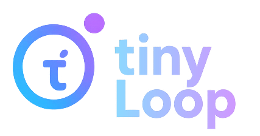

<p align="center">
  
</p>

> A lightweight Python library for building AI-powered applications with clean function calling, vision support, and structured outputs.

[](https://www.python.org/downloads/)
[](LICENSE)
[](https://pypi.org/project/tinyloop/)

TinyLoop is fully built on top of [LiteLLM](https://github.com/BerriAI/litellm), providing 100% compatibility with the LiteLLM API while adding powerful abstractions and utilities. This means you can use any model, provider, or feature that LiteLLM supports, including:

- **All LLM Providers**: OpenAI, Anthropic, Google, Azure, Cohere, and 100+ more
- **All Model Types**: Chat, completion, embedding, and vision models
- **Advanced Features**: Streaming, function calling, structured outputs, and more
- **Ops Features**: Retries, fallbacks, caching, and cost tracking

TinyLoop provides a clean, intuitive interface for working with Large Language Models (LLMs), featuring:

- 🎯 **Clean Function Calling**: Convert Python functions to JSON tool definitions automatically
- 👁️ **Vision Support**: Handle images and vision models seamlessly
- 📊 **Structured Output**: Generate structured data from LLM responses using Pydantic
- ⚡ **Async Support**: Full async/await support for all operations
- 📈 **Context Analysis (CTX)**: Monitor token usage and detect when conversations enter the "dumb zone"

## 📦 Installation

```bash
pip install tinyloop
```

## 🚀 Quick Start

### Basic LLM Usage

#### Synchronous Calls

```python
from tinyloop.inference.litellm import LLM

# Initialize the LLM
llm = LLM(model="openai/gpt-3.5-turbo", temperature=0.1)

# Simple text generation
response = llm(prompt="Hello, how are you?")
print(response)

# Get conversation history
history = llm.get_history()

# Access comprehensive response information
print(f"Response: {response}")
print(f"Cost: ${response.cost:.6f}")
print(f"Tool calls: {response.tool_calls}")
print(f"Raw response: {response.raw_response}")
print(f"Message history: {len(response.message_history)} messages")
```

#### Asynchronous Calls

```python
from tinyloop.inference.litellm import LLM

llm = LLM(model="openai/gpt-3.5-turbo", temperature=0.1)

# Async text generation
response = await llm.acall(prompt="Hello, how are you?")
print(response)
```

### Supported Features

#### 🎯 Structured Output Generation

Generate structured data using Pydantic models:

```python
from tinyloop.inference.litellm import LLM
from pydantic import BaseModel
from typing import List

class CalendarEvent(BaseModel):
    name: str
    date: str
    participants: List[str]

class EventsList(BaseModel):
    events: List[CalendarEvent]

# Initialize LLM with structured output
llm = LLM(
    model="openai/gpt-4.1-nano",
    temperature=0.1,
)

# Generate structured data
response = llm(
    prompt="List 5 important events in the XIX century",
    response_format=EventsList
)

# Access structured data
for event in response.events:
    print(f"{event.name} - {event.date}")
    print(f"Participants: {', '.join(event.participants)}")
```

#### 👁️ Vision

Work with images using various input methods:

```python
from tinyloop.inference.litellm import LLM
from tinyloop.features.vision import Image
from PIL import Image as PILImage

llm = LLM(model="openai/gpt-4.1-nano", temperature=0.1)

# From PIL Image
pil_image = PILImage.open("image.jpg")
image = Image.from_PIL(pil_image)

# From file path
image = Image.from_file("image.jpg")

# From URL
image = Image.from_url("https://example.com/image.jpg")

# Analyze image
response = llm(prompt="Describe this image", images=[image])
print(response)
```

#### 🔧 Function Calling

Convert Python functions to LLM tools with automatic schema generation:

```python
from tinyloop.inference.litellm import LLM
from tinyloop.features.function_calling import Tool
import json

def get_current_weather(location: str, unit: str):
    """Get the current weather in a given location

    Args:
        location: The city and state, e.g. San Francisco, CA
        unit: Temperature unit {'celsius', 'fahrenheit'}

    Returns:
        A sentence indicating the weather
    """
    if location == "Boston, MA":
        return "The weather is 12°F"
    return f"Weather in {location} is sunny"

# Create LLM instance
llm = LLM(model="openai/gpt-4.1-nano", temperature=0.1)

# Create tool from function
weather_tool = Tool(get_current_weather)

# Use function calling
inference = llm(
    prompt="What is the weather in Boston, MA?",
    tools=[weather_tool],
)

# Process tool calls
for tool_call in inference.raw_response.choices[0].message.tool_calls:
    tool_name = tool_call.function.name
    tool_args = json.loads(tool_call.function.arguments)
    print(f"Tool: {tool_name}")
    print(f"Args: {tool_args}")
    print(weather_tool(**tool_args))

# Access comprehensive response information
print(f"Total cost: ${inference.cost:.6f}")
print(f"Tool calls made: {len(inference.tool_calls) if inference.tool_calls else 0}")
print(f"Conversation length: {len(inference.message_history)} messages")
```

### 📝 Generate Module

Simple text generation with a clean interface:

```python
from tinyloop.modules.generate import Generate

# Synchronous generation
response = Generate.run(
    prompt="Write a haiku about programming",
    model="openai/gpt-3.5-turbo",
    temperature=0.7
)
print(response.response)

# Async generation
response = await Generate.arun(
    prompt="Explain quantum computing",
    model="openai/gpt-4",
    temperature=0.3
)
print(response.response)

# Using the class for multiple calls
generator = Generate(
    model="openai/gpt-3.5-turbo",
    temperature=0.5,
    system_prompt="You are a helpful coding assistant."
)

response1 = generator.call("How do I implement a binary search?")
response2 = generator.call("What's the time complexity?")
```

### 🎨 Prompt Rendering

Manage prompts with YAML templates and Jinja2:

```python
from tinyloop.utils.prompt_renderer import PromptRenderer, render_base_prompts

# Using PromptRenderer class
renderer = PromptRenderer("prompts/chat.yaml")
system_prompt = renderer.render("system", user_name="Alice", context="coding")
user_prompt = renderer.render("user", question="How do I debug Python?")

```

**Example YAML prompt file (`prompts/chat.yaml`):**

```yaml
system: |
  You are {{ user_name }}, a helpful AI assistant specializing in {{ context }}.
  Always provide clear, actionable advice.

user: |
  {{ user_name }}, I have a question: {{ question }}

  Please provide a detailed response with examples if relevant.
```

### 🌊 Streaming Responses

Get real-time responses as they're generated:

```python
from tinyloop.inference.litellm import LLM

llm = LLM(model="openai/gpt-3.5-turbo", temperature=0.1)

# Stream responses
for chunk in llm.stream(prompt="Write a story about a robot"):
    print(chunk.response, end="", flush=True)
```

### 📈 Context Analysis (CTX)

Monitor token usage and detect when conversations enter the "dumb zone" - a region of the context window where model performance may degrade.

#### CLI Usage

```bash
# Full report with TUI tables
tinyloop ctx conversation.json

# Simple one-line status
tinyloop ctx -s conversation.json

# Pipe from another command
cat conversation.json | tinyloop ctx

# Custom threshold (30%) and context window
tinyloop ctx -t 0.3 -c 200000 conversation.json

# Specify model for accurate tokenization
tinyloop ctx -m anthropic/claude-sonnet-4-20250514 conversation.json
```

#### Programmatic API

```python
from tinyloop.ctx import CTXAnalyzer, analyze_conversation, get_status

# Quick status check
messages = [
    {"role": "system", "content": "You are a helpful assistant."},
    {"role": "user", "content": "Hello!"},
    {"role": "assistant", "content": "Hi there! How can I help?"},
]

status = get_status(messages, model="gpt-4", threshold=0.4)
print(status.message)
# Output: ✓ 45 / 67,200 tokens (0.0%) — 67,155 tokens until dumb zone

# Full analysis
analyzer = CTXAnalyzer(
    model="anthropic/claude-sonnet-4-20250514",
    context_window=168000,
    threshold=0.4
)
result = analyzer.analyze(messages)

print(f"Total tokens: {result.total_tokens}")
print(f"In dumb zone: {result.is_in_dumb_zone}")
print(f"Categories: {result.categories}")
```

#### LLM Integration with Middleware

```python
from tinyloop import LLM
from tinyloop.ctx import CTXMiddleware, CTXThresholdExceeded

# Create middleware with warning action
ctx = CTXMiddleware(
    context_window=168000,
    threshold=0.4,
    action="warn"  # or "raise" to throw exception
)

# Use with LLM
llm = LLM(model="anthropic/claude-sonnet-4-20250514")
llm(prompt="Hello!")
llm(prompt="Tell me about Python")

# Check status at any point
status = ctx.check(llm)
print(status.message)

if status.is_in_dumb_zone:
    print("Warning: Consider summarizing the conversation")

# Or use raise action to stop when threshold exceeded
ctx_strict = CTXMiddleware(threshold=0.4, action="raise")
try:
    # ... long conversation ...
    ctx_strict.check(llm)
except CTXThresholdExceeded as e:
    print(f"Threshold exceeded at {e.percentage_used:.1%}")
```

### 🛡️ Error Handling and Retries

Handle errors gracefully with retry patterns:

```python
from tinyloop.inference.litellm import LLM
import time
import random

def robust_llm_call(llm, prompt, max_retries=3, delay=1):
    """Make LLM calls with retry logic"""
    for attempt in range(max_retries):
        try:
            response = llm(prompt=prompt)
            return response
        except Exception as e:
            if attempt == max_retries - 1:
                raise e
            print(f"Attempt {attempt + 1} failed: {e}")
            time.sleep(delay * (2 ** attempt) + random.uniform(0, 1))

    return None

# Usage
llm = LLM(model="openai/gpt-3.5-turbo", temperature=0.1)
response = robust_llm_call(
    llm,
    "Explain the concept of machine learning",
    max_retries=3
)
print(response.response)
```

## 🏗️ Project Structure

```
tinyloop/
├── ctx/
│   ├── analyzer.py          # Core CTX analysis logic
│   ├── categories.py        # Token categorization
│   ├── cli.py               # CLI implementation
│   ├── middleware.py        # LLM integration middleware
│   └── tokenizers.py        # Tokenizer abstractions
├── features/
│   ├── function_calling.py  # Function calling utilities
│   └── vision.py            # Vision model support
├── inference/
│   ├── base.py              # Base inference classes
│   └── litellm.py           # LiteLLM integration
├── modules/
│   ├── base_loop.py         # Base loop implementation
│   └── generate.py          # Generation modules
└── utils/
    └── prompt_renderer.py   # Prompt rendering utilities
```

## 🧪 Development

### Running Tests

```bash
# Run all tests
pytest tests/

# Run specific test file
pytest tests/test_function_calling.py -v

# Run with coverage
pytest tests/ --cov=tinyloop
```

### Examples

Check out the Jupyter notebooks for more detailed examples:

- [`basic_usage.ipynb`](notebooks/basic_usage.ipynb) - Basic usage examples
- [`modules.ipynb`](notebooks/modules.ipynb) - Advanced module usage
- [`ctx_analysis.ipynb`](notebooks/ctx_analysis.ipynb) - Context analysis and dumb zone detection

## 🤝 Contributing

We welcome contributions! Please feel free to submit a Pull Request. For major changes, please open an issue first to discuss what you would like to change.

## 📄 License

This project is licensed under the MIT License - see the [LICENSE](LICENSE) file for details.

---

<div align="center">
Made with ❤️ for the AI community
</div>
